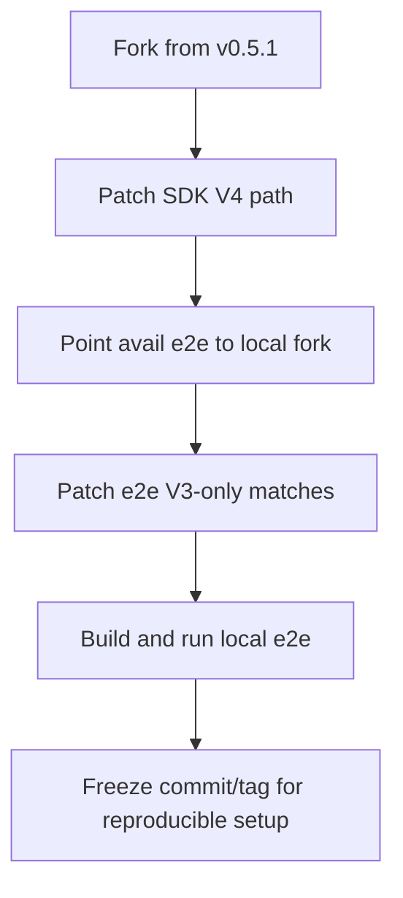

# Plan fork và sửa avail-rust để match Avail V4/CDA

## Mục tiêu

- Tạo fork SDK tại `/home/ubuntu` từ mốc `v0.5.1`.
- Đảm bảo SDK decode/handle đúng `HeaderExtension::V4` của chain Avail hiện tại.
- Cập nhật repo Avail hiện tại để trỏ sang fork và chạy e2e local ổn định.

## Files/areas sẽ thay đổi

- SDK fork:
  - `[/home/ubuntu/avail-rust/core/src/lib.rs](/home/ubuntu/avail-rust/core/src/lib.rs)`
  - `[/home/ubuntu/avail-rust/core/src/header_next.rs](/home/ubuntu/avail-rust/core/src/header_next.rs)`
  - `[/home/ubuntu/avail-rust/client/src/lib.rs](/home/ubuntu/avail-rust/client/src/lib.rs)`
  - `[/home/ubuntu/avail-rust/client/Cargo.toml](/home/ubuntu/avail-rust/client/Cargo.toml)`
- Repo Avail đang chạy e2e:
  - `[/home/ubuntu/avail/e2e/Cargo.toml](/home/ubuntu/avail/e2e/Cargo.toml)`
  - `[/home/ubuntu/avail/e2e/src/tests/rpc_queries.rs](/home/ubuntu/avail/e2e/src/tests/rpc_queries.rs)`
  - (nếu phát sinh) các file trong `[/home/ubuntu/avail/e2e/src/tests](/home/ubuntu/avail/e2e/src/tests)` đang `match HeaderExtension::V3`

## Luồng triển khai

## Bước 1: Fork SDK về `/home/ubuntu` và thay link GitHub bằng local path

- Clone từ upstream `avail-rust` tại tag `v0.5.1` vào `[/home/ubuntu/avail-rust](/home/ubuntu/avail-rust)`.
- Tạo branch làm việc riêng (ví dụ `cda-v4-compat`).
- Cập nhật `[/home/ubuntu/avail/e2e/Cargo.toml](/home/ubuntu/avail/e2e/Cargo.toml)` để thay dependency GitHub bằng local path trỏ tới fork vừa clone.
- Build nhanh e2e để xác nhận wiring local path đã đúng trước khi sửa logic V4/CDA.

## Bước 2: Chuẩn hóa hỗ trợ V4 trong SDK fork

- Xác nhận `core` dùng `header_next` khi bật feature `next` (đường V4).
- Chuẩn hóa export ở `client` để không khóa cứng vào type V3-only.
- Đảm bảo mọi decode/serialize liên quan block header hoạt động với `V4` (và không phá V3 nếu cần tương thích ngược).
- Nếu cần, đặt feature mặc định nội bộ cho nhánh fork dùng CDA để giảm rủi ro quên bật `next`.

## Bước 3: Trỏ e2e repo Avail sang SDK fork local

- Ở `e2e/Cargo.toml`, chuyển dependency sang path/git của fork local tại `/home/ubuntu/avail-rust` (ưu tiên path trong giai đoạn dev).
- Bật feature phù hợp cho V4/CDA (ít nhất `next`; giữ `native` theo nhu cầu runtime hiện tại).

## Bước 4: Patch e2e code chỗ còn hardcode V3

- Rà các `match HeaderExtension::V3(...)` trong e2e tests.
- Thay bằng nhánh xử lý cả `V3` và `V4`, hoặc dùng accessor abstraction chung để tránh phụ thuộc chi tiết version.
- Đặc biệt cập nhật `rpc_queries.rs` nơi đang match V3 trực tiếp để lấy commitment/rows/cols.

## Bước 5: Validate end-to-end theo đúng flow local

- Build `avail-node` release trong repo Avail.
- Build e2e với dependency trỏ về fork SDK.
- Chạy `avail-node --dev --tmp` và chạy các scenario e2e chính (`max_block_submit` + CDA scenarios).
- Xác nhận hết lỗi decode kiểu `unknown variant V4`.

## Bước 6: Đóng gói mốc ổn định

- Chốt commit trong fork SDK + ghi lại SHA/tag nội bộ dùng cho repo Avail.
- Chuyển `e2e/Cargo.toml` từ `path` sang `git + rev` (nếu muốn reproducible cho CI/team).
- Viết ghi chú ngắn về matrix tương thích: `Avail runtime version` ↔ `SDK fork rev`.

## Rủi ro và kiểm soát

- Drift API giữa SDK mới và code e2e cũ: xử lý bằng patch adapter tối thiểu trong e2e tests.
- Bật sai feature dẫn đến lại decode V3: khóa bằng cấu hình dependency rõ `features = ["next"]`.
- Khác biệt môi trường local/CI: chốt bằng `rev` cố định sau khi pass local.

